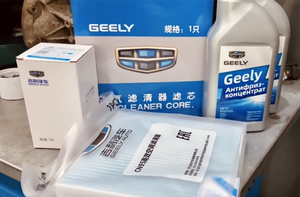

# Техничка
Здесь находятся номера, ссылки на запчасти, каталоги, советы, особенности, рекомендации и т.д.

## Быстрый набор

Зарекомендовавший себя набор запчастей, так сказать бери и не думай.

| Наименование запчасти                                 | Номер          |
|-------------------------------------------------------|----------------|
| Фильтр масляный                                       | SCT SH4823P    |
| MANNOL Масло моторное LEGEND FORMULA C5 0W-20         | MN7921-5 и MN7921-1 |
| Салонный фильтр                                       | RST014         |
| Фильтр воздушный                                      | AF018          |
| Прокладка сливной пробки масл. поддона                | 1056020700     |

## Каталоги

#### Онлайн
- [https://acat.online/catalogs/CARS_FOREIGN/GEELY/60751/](https://acat.online/catalogs/CARS_FOREIGN/GEELY/60751/)
- [https://hot-parts.ru/catalog/19204/](https://hot-parts.ru/catalog/19204/)

#### PDF
Большой каталог с номерами запчастей и картинками.
Найдено в интернете.

[Каталог.pdf](https://qttc.github.io/assets/pdf/catalog_parts.pdf)

## Запчасти

### Тормозные колодки
[Geely Колодки тормозные 4048046400 Передние](https://ozon.ru/t/jYjlMDk)

### Масло

Масло, рекомендованное производителем:

🛢 Рекомендуемый класс масла API SP, ACEA C5, VCC RBS0-2AE, класс вязкости 0W20. 
Рекомендация GEELY: Lopal 1 Advance Fully Synthetic Series SP 0W-20

⚠️ Объём для замены 5,6 ± 0,1

Вариации:
- [Масло моторное MANNOL legend formula c5 0W-20 Синтетическое 5 л](https://ozon.ru/t/nYRd31V )
- [MANNOL Масло моторное Синтетическое 1 л](https://ozon.ru/t/X8byEkD)
- [MANNOL Legend Formula C5 моторное масло 0W20 синтетическое 5л](https://www.wildberries.ru/catalog/81580154/detail.aspx )

### Фильтры

[Фильтр салонный 8022021300](https://ozon.ru/t/P2yEpq2 )
[Масляный фильтр GEELY COOLRAY SX11 / Geely Atlas PRO 1056022300](https://ozon.ru/t/dkNG3XJ )
[Фильтр Воздушный Geely Coolray 2032040500](https://ozon.ru/t/RowNPLL)
[Фильтр топливный GEELY 2013021700](https://ozon.ru/t/nYRd3AL)

---
## Проблемы

### Жарит климат
Попросить дилера обновить прошивку климата до версии 9117.

### Стук в подвеске

> Кто-нибудь менял втулки переднего стабилизатора на кулреи а то пробег 70 тысяч. Просто втулки идут в сборе с тягой ,а я на всех машинах менял их через 10-12 тысяч.

Как мне объяснили там бочкообразность внутри визуально сильно не заметно, а когда бухать будут это уже капец.

### Предохранители
Описание: [https://geely-club.by/viewtopic.php?f=279&t=1869](https://geely-club.by/viewtopic.php?f=279&t=1869)

### Отвал стеклоподъемника

В блоке предохранителей вынуть пред номер 33 предохранитель 30А - стеклоподъемники

### Проблема форсунок омывателя

Обратный клапан системы омывателя: 8532126020
[Ссылка на Drive](https://www.drive2.ru/parts/toyota-lexus/8532126020/B9bjwEAAGmM)

### Скрипит люк при закрытии
Смазка подвижных частей люка и уход за резинками Джили рекомендует делать эту процедуру каждые 6 месяцев или 5000 пробега. Для резинок используем силиконовые смазки для люков.
[Ссылка на Drive](https://www.drive2.ru/l/643905621258679023/) 

### Замена тормозных колодок

Очень насущная проблема у Кулрея — это передние тормозные диски. В среднем к 20 тыс пробега они начинают бить.
[Ссылка на Drive](https://www.drive2.ru/l/663420578262173512/)

## Китайское ГУ 
### Регистрация китайских ГУ

Вам нужно зарегистрироваться в wechat, там есть сервис esender через который можно оформить китайский номер на который будут приходить смс. На 7 дней номер дают бесплатно, потом надо платить, я взял пока на 1 год за 1600 рублей.

## Модем 4g в машину

Подключение модема. 
Оставлю тут для истории, потому что информацию пришлось собирать по крупицам. 
Настроил сегодня 4G USB модем Huawei E3272h-153 для работы с ГУ, чтобы в авто был постоянный интернет и не надо было раздавать с телефона каждый раз. Для этого прошил модем HiLink прошивкой c Web UI по инструкции с 4PDA. Однако, для работы в ГУ этого недостаточно, т.к. после прошивки модем по умолчанию работает в режиме NDIS, который совместим с Windows (там все работает), но несовместим с ГУ. Модем надо перевести в режим CDC и установить время автопереключения в 1 секунду (по умолчанию стоит 30). Делается это через Web интерфейс. После перезагрузки модема в этом режиме он перестанет быть виден в виде сетевого интерфейса в Windows - значит все ок, можно нести в ГУ, подключать в любой USB порт.

## Антена штатного брелка (проверить)

> а никто не видел у нас аналогичный разъём под обшивкой крыши валяется? 

Доп. антенна в блок сигналки - [ссылка на Drive](https://www.drive2.ru/l/666358473331596058/)