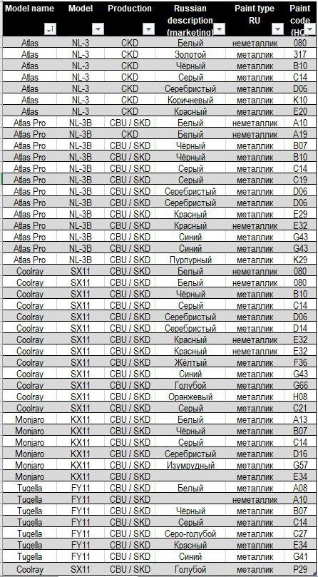

# Техничка

Собраны основные позиции запчастей — и для планового ТО, и для других работ — с номерами и аналогами; даны рекомендации по маслам для двигателя и коробки и ссылки на каталоги и PDF-руководства по ремонту и электросхемам.

## Быстрый набор

Зарекомендовавший себя набор запчастей, так сказать бери и не думай.

Вот обновленная таблица с добавленными запчастями:

| Наименование запчасти                                  | Номер               |
| ------------------------------------------------------ | ------------------- |
| Фильтр масляный                                        | SH4823P             |
| Салонный фильтр                                        | RST014              |
| Фильтр воздушный                                       | AF018               |
| Прокладка сливной пробки масл. поддона                 | 1056020700          |
| Антифриз GEELY концентрат (если нету можно G12 и G12+) | LPAFRZ01L           |
| **Масло для двигателя**                                |                     |
| Lopal 1 Advanced Fully Synthetic Series SP 0W-20 1л    | LP0W20AFS1L         |
| Lopal 1 Advanced Fully Synthetic Series SP 0W-20 4л    | LP0W20AFS4L         |
| Valvoline SYNPOWER FE 0W-20 5л                         | 872584              |
| Valvoline SYNPOWER FE 0W-20 1л                         | 872583              |
| MANNOL LEGEND FORMULA C5 0W-20 5л и 1л                 | MN7921-5 и MN7921-1 |
| Petrol Ofisi MAXIMA HYBRID 0W-20 4л                    | 400000419           |
| G-Energy Synthetic Eco Life 0W-20 1л                   | 253140709           |
| G-Energy Synthetic Eco Life 0W-20 4л                   | 253140711           |
| Liqui Moly SPECIAL TEC V 0W-20 5л                      | 20632               |
| Liqui Moly SPECIAL TEC V 0W-20 1л                      | 20631               |
| Bardahl XTEC 0w20 V 5л                                 | 36813               |
| Bardahl XTEC 0w20 V 1л                                 | 36811               |
| RAVENOL EFS 0W-20 4л                                   | 1111105             |
| RAVENOL EHS 0W-20 4л                                   | 1111113             |
| LUKOIL GENESIS SPECIAL VL 0W-20 1л                     | 1702475             |

## Масло для коробки

| **Масло для РКПП**                                     | Артикул             |
|--------------------------------------------------------|---------------------|
| Shell Spirax S5 DCT 10                                 | 55004597301        |
| Hitatsu DCT/DSG MULTI LV                               | ATFDCT4 / ATFDCT1 |
| Motul High Torque DCTF                                 | 110440             |
| RAVENOL DCT-DSG LV Fluid                               | 1212107            |
| ЛУКОЙЛ DCTF (или любое другое DCTF)                    | 3261423            |
| LUKOIL DCTF FE                                   | 3695910 / 3695912 |

## Колодки и диски в круг

| Наименование запчасти                      | Номер    |
| ------------------------------------------ | -------- |
| MONAER передние тормозные диски            | M21409   |
| MONAER задние тормозные диски              | M12778   |
| MONAER Колодки тормозные передние керамика | M2505    |
| MONAER Колодки тормозные задние керамика   | M4015    |
| Колодки тормозные передние SAT             | ST280124 |
| Колодки тормозные задние SAT               | ST280125 |

## Остальные запчасти

| Наименование запчасти | Номер       |
|------------------------|-------------|
| Оригинал              | 2036512100  |
| VOLVO                 | 32208336    |

## Каталоги

#### Запчасти (заказ)
- [zzap](https://www.zzap.ru/)
- [exist](https://www.exist.ru/)
- [autodoc](https://www.autodoc.ru/)
- [auto3n](https://auto3n.ru/)
- [gettzap](https://gettzap.ru/)

#### Онлайн каталог запчастей
- [https://acat.online](https://acat.online/catalogs/CARS_FOREIGN/GEELY/60751/null)
- [https://hot-parts.ru](https://hot-parts.ru/catalog/19204/)
- [китайавто.рус](https://китайавто.рус/catalog/geely/87de53f0cf06ed651237f5c28aa9a774)

------

#### PDF Документы

Большой каталог с номерами запчастей и картинками.

- [Каталог кодов запчастей](https://qttc.github.io/assets/pdf/catalog_parts.pdf)

Руководство по ремонту содержит технические характеристики и информацию по диагностике и ремонту модели Geely Coolray

- [Электрические схемы](https://qttc.github.io/assets/pdf/Принципиальные_электрические_схемы_GEELY_Coolray_SX11.pdf)
- [Service Manual](https://qttc.github.io/assets/pdf/Service_Manual_2019.pdf)
- [Engine Manual](https://qttc.github.io/assets/pdf/Engine_Manual_2019.pdf)

------

## Запчасти

### Щетки стеклоочистителя (оригинал)

6020021800
6020021500

### Тормозные диски и колодки

[https://www.drive2.ru/l/661322984954286907/](https://www.drive2.ru/l/661322984954286907/)

### Масло

Масло, рекомендованное производителем:

🛢 Рекомендуемый класс масла API SP, ACEA C5, VCC RBS0-2AE, класс вязкости 0W20. 
Рекомендация GEELY: Lopal 1 Advance Fully Synthetic Series SP 0W-20

⚠️ Объём для замены 5,6 ± 0,1

### Таблица цветов (коды краски)

------

[Вернуться на главную](https://qttc.github.io/)